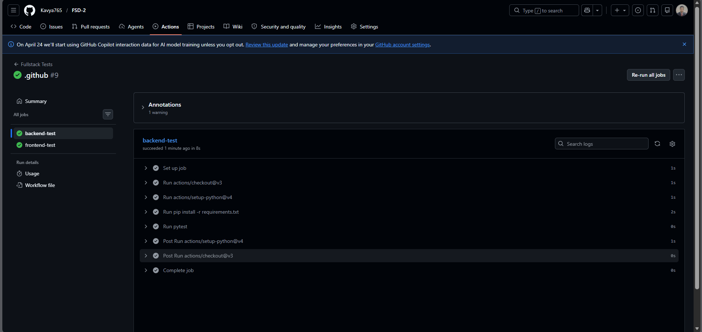
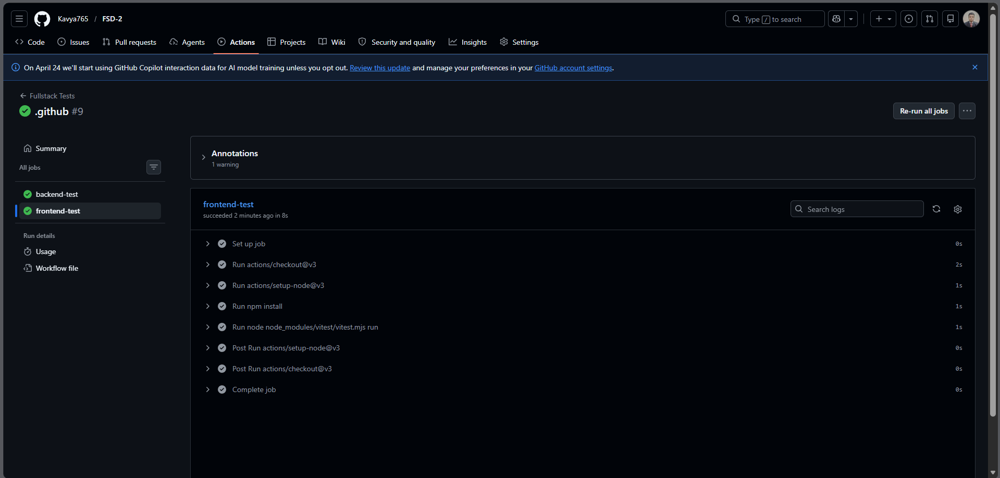
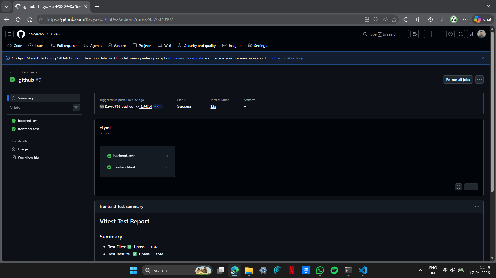
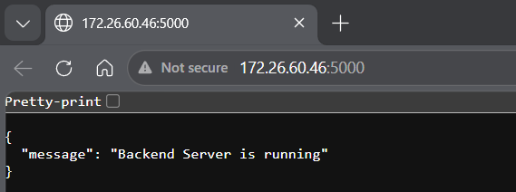
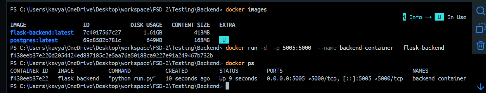
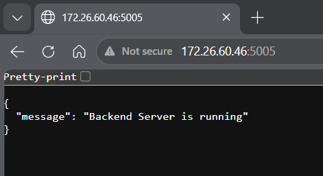

# Experiment 16 - Unit Testing for Frontend and Backend

## Objective

To perform unit testing for backend APIs using pytest and frontend forms/components using Vitest, and automate testing using GitHub Actions.

---
## Backend Test Output


## Frontend Test Output


## GitHub Actions Workflow


## Running on Port 5000


## Docker Terminal


## Running on Port 5005


## Project Structure

```plaintext
FSD-2/
├── .github/
│   └── workflows/
│       └── ci.yml
├── Testing/
│   ├── Backend/
│   │   ├── test_sample.py
│   │   └── requirements.txt
│   └── Frontend/
│       ├── package.json
│       ├── package-lock.json
│       └── sample.test.js
└── README.md
```

---

## Backend Testing (pytest)

### Install Dependencies

```
python -m pip install -r requirements.txt
```

### Run Tests

```
python -m pytest
```

### Sample Test

```
def test_add():
    assert 2 + 2 == 4
```

---

## Frontend Testing (Vitest)

### Install Dependencies

```
npm install
```

### Run Tests

```
npm run test
```

### Sample Test

```
import { describe, it, expect } from 'vitest'

describe('basic test', () => {
  it('works', () => {
    expect(1 + 1).toBe(2)
  })
})
```

---

## GitHub Actions Workflow

* Automatically runs tests on every push and pull request.
* Backend and frontend tests are executed in parallel.

### Workflow Features:

* Python setup for pytest
* Node.js setup for Vitest
* Automated test execution
* CI validation

---

## Output

* Backend tests passed successfully
* Frontend tests passed successfully
* GitHub Actions workflow executed successfully

---

## Conclusion

## Unit testing was successfully implemented for both backend and frontend modules. Continuous Integration using GitHub Actions ensured automated testing and validation of code.
