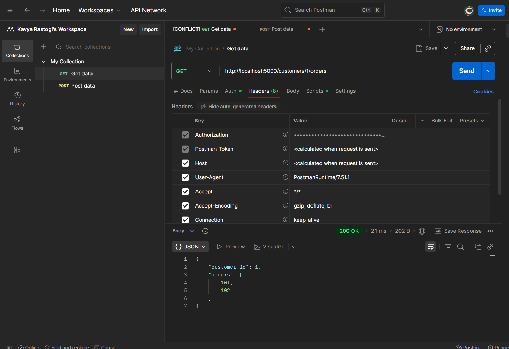
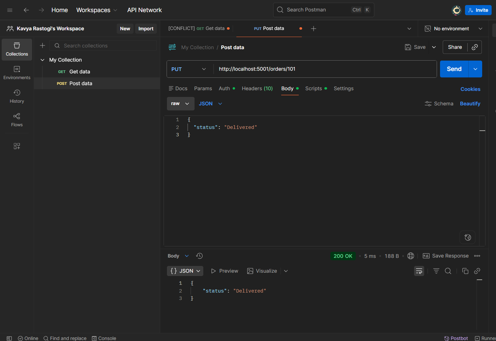

Learning Outcomes:
Learned basics of microservices architecture
Implemented APIs using Flask
Worked with in-memory data storage
Tested APIs using Postman
Understood REST API methods (GET, PUT)
Deployed backend services on Render

## Screenshots

## Render
